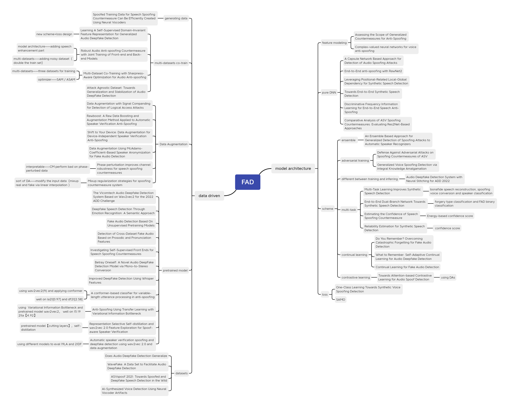

# Awesome-fake-audio-detection

A list of tools, papers and code related to Fake Audio Detection.. 

If you want to contribute to this list, welcome to send me a pull request or contact me :) 

This repo only collect papers related to FAD.  

Here is nothing about speech signal processing, speech synthesis, Speech Enhancement, data augmentation, voice conversion and speech edition. But learning them is beneficial to your research about FAD.

**🌟🌟🌟This repository will be actively maintained. If any work has not been recorded, feel free to submit an issue.🌟🌟🌟**

## Contents

- [Datasets](#datasets)
- [Competitions](#competitions)
- [Tools](#tools)
- [Recent Conference Papers](#recent-conference-papers)
- [different category](#category)
- [enlightening](#enlightening)

# survey
-  [Audio Anti-Spoofing Detection: A Survey](https://arxiv.org/abs/2404.13914) 
-  [Audio Deepfake Detection: A Survey](https://arxiv.org/abs/2308.14970)
-  [A Comprehensive Survey with Critical Analysis for Deepfake Speech Detection](https://arxiv.org/pdf/2409.15180)
-  [A Survey on Speech Deepfake Detection](https://dl.acm.org/doi/abs/10.1145/3714458)
-  [Manipulated Regions Localization For Partially Deepfake Audio: A Survey](https://arxiv.org/abs/2506.14396)

# benchmark
- LOKI: A Comprehensive Synthetic Data Detection Benchmark using Large Multimodal Models [multi-modal benchmark including speech](https://github.com/opendatalab/LOKI)

# datasets

- **ASVspoof2015-2017-2019-2021:** [website](https://www.asvspoof.org/database )
- **ASVspoof 5** [unofficial dataset mirror on huggingface](https://huggingface.co/datasets/jungjee/asvspoof5) [paper](https://arxiv.org/abs/2502.08857)
- **MLAAD** [website](https://deepfake-total.com/mlaad) [paper](https://arxiv.org/pdf/2401.09512) [dataset download](https://huggingface.co/datasets/mueller91/MLAAD) 
- **Voc.V** [dataset](https://github.com/nii-yamagishilab/project-NN-Pytorch-scripts/tree/master/project/09-asvspoof-vocoded-trn) [paper](https://arxiv.org/abs/2210.10570)
- **partial spoof**: [paper](https://arxiv.org/pdf/2204.05177.pdf) [dataset download](https://zenodo.org/record/5766198)
- **wavefake**:  [paper](https://arxiv.org/pdf/2111.02813.pdf)  [dataset download](https://zenodo.org/record/5642694#:~:text=WaveFake%3A%20A%20data%20set%20to%20facilitate%20audio%20DeepFake,finding%20new%20detection%20methods%20to%20prevent%20such%20attempts.) 
- **In-the-Wild:**  [website](https://deepfake-demo.aisec.fraunhofer.de/in_the_wild)  [paper](https://arxiv.org/pdf/2203.16263.pdf)  [dataset download](https://owncloud.fraunhofer.de/index.php/s/JZgXh0JEAF0elxa)
- **ReplayDF** [website](https://deepfake-total.com/replaydf) [paper](https://arxiv.org/abs/2505.14862) [dataset download](https://huggingface.co/datasets/mueller91/ReplayDF)
- **APTLY** [website](https://bil.eecs.yorku.ca/datasets/)
- **SpoofCeleb** [website](https://www.jungjee.com/spoofceleb/)

⭐more datasets info can be found in this [repo](https://github.com/AI-ResearchGroup/A-Comprehensive-Survey-with-Critical-Analysis-for-Deepfake-Speech-Detection) and this chinese [blog](https://mp.weixin.qq.com/s/RbIBA51VQQyHO52PFIhBJg)

# competitions

- **ASVspoof:** https://www.asvspoof.org/

# tools

[interactive deepfake literature search tool](https://deepfake-total.com/related_work/)

[asvspoof2021 baseline implementation](https://github.com/asvspoof-challenge/2021.git)

[torch_lightning framework for fad](https://github.com/john852517791/pytorch_lightning_FAD)

# new arxiv （might be meaningful）
-  Vision Graph Non-Contrastive Learning for Audio Deepfake Detection with Limited Labels [may be submitted 2 trans](https://arxiv.org/abs/2501.04942)
-  Are audio DeepFake detection models polyglots? [may be submitted 2 conference](https://arxiv.org/abs/2412.17924) [⭐code!!!](https://github.com/bartlomiejmarek/are_audio_df_polyglots)
-  Neural Codec Source Tracing: Toward Comprehensive Attribution in Open-Set Condition [may be submitted 2 conference](https://arxiv.org/abs/2501.06514) [⭐code!!!](https://github.com/xieyuankun/ST-Codecfake)
-  CodecFake+: A Large-Scale Neural Audio Codec-based Deepfake Speech Dataset [may be submitted 2 TASLP](https://arxiv.org/abs/2501.08238)
-  Unmasking Deepfakes: Leveraging Augmentations and Features Variability for Deepfake Speech Detection [submitted 2 speech communication](https://arxiv.org/abs/2501.05545)
-  What Does an Audio Deepfake Detector Focus on? A Study in the Time  Domain. [paper](https://arxiv.org/abs/2501.13887?)
-  6KSFx Synth Dataset. [paper](https://arxiv.org/abs/2501.17198) [⭐code!!!](https://github.com/nellyngz95/6KSFX)
-  Deepfake Detection of Singing Voices With Whisper Encodings. [paper](https://arxiv.org/abs/2501.18919)
-  Towards Explainable Spoofed Speech Attribution and Detection:a Probabilistic Approach for Characterizing Speech Synthesizer Components. [interpretable](https://arxiv.org/abs/2502.04049)
-  Comprehensive Layer-wise Analysis of SSL Models for Audio Deepfake Detection. [interpretable, but nothing new 4 FAD](https://arxiv.org/abs/2502.03559)
-  Less is More for Synthetic Speech Detection in the Wild. [paper](https://arxiv.org/abs/2502.05674)
-  Pitch Imperfect: Detecting Audio Deepfakes Through Acoustic Prosodic Analysis. [paper](https://arxiv.org/abs/2502.14726)
-  Generalizable speech deepfake detection via meta-learned LoRA. [paper](https://arxiv.org/abs/2502.10838)
-  DeePen: Penetration Testing for Audio Deepfake Detection. [paper](https://arxiv.org/abs/2502.20427)
-  Adaptive Mixture of Experts Learning for Robust Audio Spoofing Detection. [paper](https://arxiv.org/abs/2503.12010)
-  Emergent Capability in Audio Deepfake Detection. [paper](https://www.researchgate.net/profile/Yunbin-Deng/publication/389939872_Emergent_Capability_in_Audio_Deepfake_Detection/links/67d9720b35f7044c9232bce2/Emergent-Capability-in-Audio-Deepfake-Detection.pdf)
-  Anomaly Detection and Localization for Speech Deepfakes via Feature Pyramid Matching. [paper](https://arxiv.org/abs/2503.18032)
-  Measuring the Robustness of Audio Deepfake Detectors. [paper](https://arxiv.org/abs/2503.17577)
-  Cross-Technology Generalization in Synthesized Speech Detection:  Evaluating AST Models with Modern Voice Generators. [paper](https://arxiv.org/abs/2503.22503)
-  The Interpretable and Transferable Adversarial Attack Against Synthetic Speech Detectors. [paper](https://dl.acm.org/doi/abs/10.1145/3727341)
-  Nes2Net: A Lightweight Nested Architecture for Foundation Model Driven Speech Anti-spoofing. [paper]( https://arxiv.org/abs/2504.05657) [⭐code!!!](https://github.com/Liu-Tianchi/Nes2Net)
-  Detect All-Type Deepfake Audio: Wavelet Prompt Tuning for Enhanced Auditory Perception. [paper](https://arxiv.org/abs/2504.06753) [⭐code !!!](https://github.com/xieyuankun/All-Type-ADD)
-  End-to-end Audio Deepfake Detection from RAW Waveforms: a RawNet-Based Approach with Cross-Dataset Evaluation. [paper](https://arxiv.org/pdf/2504.20923) [⭐code!!!](https://github.com/adipiz99/rawnetlite)
-  Detecting Musical Deepfakes. [paper](https://arxiv.org/abs/2505.09633)
-  LLM4ADD: Unlocking the Capabilities of Audio Large Language Models for Audio Deepfake Detection. [paper](https://arxiv.org/abs/2505.11079) [⭐code!!!](https://github.com/ucas-hao/qwen_audio_for_add)
-  What You Read Isn't What You Hear: Linguistic Sensitivity in Deepfake Speech Detection. [paper](https://arxiv.org/abs/2505.17513)
-  Replay Attacks Against Audio Deepfake Detection. [interspeech25](http://arxiv.org/pdf/2505.14862v1)
-  Source Verification for Speech Deepfakes. [interspeech25](http://arxiv.org/pdf/2505.14188v1)
-  BiCrossMamba-ST: Speech Deepfake Detection with Bidirectional Mamba Spectro-Temporal Cross-Attention. [interspeech25](http://arxiv.org/pdf/2505.13930v1)
-  Forensic deepfake audio detection using segmental speech features. [paper](http://arxiv.org/pdf/2505.13847v1)
-  Listen, Analyze, and Adapt to Learn New Attacks: An Exemplar-Free Class Incremental Learning Method for Audio Deepfake Source Tracing. [interspeech25](http://arxiv.org/pdf/2505.14601v1)
-  Codec-Based Deepfake Source Tracing via Neural Audio Codec Taxonomy [Interspeech 2025](https://arxiv.org/abs/2505.12994)
-  BanglaFake: Constructing and Evaluating a Specialized Bengali Deepfake Audio Dataset. [dataset paper](http://arxiv.org/pdf/2505.10885v1) [⭐code!!!](https://github.com/KamruzzamanAsif/BanglaFake)
-  Where are We in Audio Deepfake Detection? A Systematic Analysis over Generative and Detection Models. [ACM TIT](https://dl.acm.org/doi/abs/10.1145/3736765)
-  Few-Shot Speech Deepfake Detection Adaptation with Gaussian Processes. [paper](https://arxiv.org/abs/2505.23619) [⭐code!!!](https://github.com/netaglazer/ADD-GP)
-  Can Emotion Fool Anti-spoofing? [paper](https://arxiv.org/abs/2505.23962) 
-  Rehearsal with Auxiliary-Informed Sampling for Audio Deepfake Detection[paper](https://arxiv.org/abs/2505.24486)  [⭐code!!!](https://github.com/falihgoz/RAIS)
-  RPRA-ADD: Forgery Trace Enhancement-Driven Audio Deepfake Detection.[paper](https://arxiv.org/abs/2506.00375) [⭐code soon!!!](https://github.com/WWWWxp/PRA-ADD)
-  XMAD-Bench: Cross-Domain Multilingual Audio Deepfake Benchmark. [paper](https://arxiv.org/abs/2506.00462)
-  Unveiling Audio Deepfake Origins: A Deep Metric learning And Conformer Network Approach With Ensemble Fusion. [paper](https://arxiv.org/abs/2506.02085)
-  Trusted Fake Audio Detection Based on Dirichlet Distribution. [paper](https://arxiv.org/abs/2506.02401)
-  A Data-Driven Diffusion-based Approach for Audio Deepfake Explanations. [paper](https://arxiv.org/abs/2506.03425)
-  Towards Source Attribution of Singing Voice Deepfake with Multimodal Foundation Models. [paper](https://arxiv.org/abs/2506.03364) [⭐code soon!!!](https://github.com/Helix-IIIT-Delhi/COFFE-Singing_Voice_Deepfake)
-  Bayesian Learning for Domain-Invariant Speaker Verification and  Anti-Spoofing. [paper](https://arxiv.org/abs/2506.0753622)
-  Can Quantized Audio Language Models Perform Zero-Shot Spoofing  Detection? [paper](https://arxiv.org/abs/2506.0675612)
-  Towards Generalized Source Tracing for Codec-Based Deepfake Speech. [paper](https://arxiv.org/abs/2506.072947)
-  Lightweight Joint Audio-Visual Deepfake Detection via Single-Stream  Multi-Modal Learning Framework. [paper](https://arxiv.org/abs/2506.07358)
-  TADA: Training-free Attribution and Out-of-Domain Detection of Audio  Deepfakes. [paper](https://arxiv.org/abs/2506.05802) [⭐code!!!](https://github.com/adrianastan/tada)  
-  Sharpness to Better Generalization for Speech Deepfake Detection. [paper](https://arxiv.org/abs/2506.11532)
-  Amplifying Artifacts with Speech Enhancement in Voice Anti-spoofing. [paper](https://arxiv.org/abs/2506.11542)
-  Towards Neural Audio Codec Source Parsing. [paper](https://arxiv.org/abs/2506.12627)
-  Pushing the Performance of Synthetic Speech Detection with  Kolmogorov-Arnold Networks and Self-Supervised Learning Models. [paper](https://arxiv.org/abs/2506.14153)
-  A Comparative Study on Proactive and Passive Detection of Deepfake  Speech. [paper](https://arxiv.org/abs/2506.14398)
-  IndieFake Dataset: A Benchmark Dataset for Audio Deepfake Detection. [paper](https://arxiv.org/abs/2506.19014)
-  Post-training for Deepfake Speech Detection. [paper](https://arxiv.org/abs/2506.21090) 
-  Generalizable Detection of Audio Deepfakes. [paper](https://arxiv.org/abs/2507.01750) 
-  Phoneme-Level Analysis for Person-of-Interest Speech Deepfake Detection [paper](https://arxiv.org/abs/2507.08626) 
- RawTFNet: A Lightweight CNN Architecture for Speech Anti-spoofing. [paper](https://arxiv.org/abs/2507.08227)
-  Towards Scalable AASIST: Refining Graph Attention for Speech Deepfake Detection. [paper](http://arxiv.org/pdf/2507.11777v1) [⭐code!!!](https://github.com/KORALLLL/AASIST_SCALING)
-  Evaluation framework for deepfake speech detection: a comparative study of state-of-the-art deepfake speech detectors. [paper](https://link.springer.com/article/10.1186/s42400-024-00346-1)
-  ESDD 2026: Environmental Sound Deepfake Detection Challenge Evaluation Plan. [paper](https://arxiv.org/abs/2508.04529) [⭐code!!!](https://github.com/apple-yinhan/EnvSDD)
-  Multilingual Source Tracing of Speech Deepfakes: A First Benchmark. [paper](https://arxiv.org/abs/2508.04143) [⭐code soon!!!](https://github.com/xuanxixi/Multilingual-Source-Tracing)
-  Towards Reliable Audio Deepfake Attribution and Model Recognition: A Multi-Level Autoencoder-Based Framework. [paper](https://arxiv.org/abs/2508.02521)
-  Generalizable Audio Deepfake Detection via Hierarchical Structure Learning and Feature Whitening in Poincaré sphere. [paper](https://arxiv.org/abs/2508.01897)
-  Fake-Mamba: Real-Time Speech Deepfake Detection Using Bidirectional Mamba as Self-Attention's Alternative. [IEEE ASRU](https://arxiv.org/abs/2508.09294) [⭐code soon!!!](https://github.com/xuanxixi/Fake-Mamba)
-  Pindrop it! Audio and Visual Deepfake Countermeasures for Robust Detection and Fine Grained-Localization. [paper](https://arxiv.org/abs/2508.08141)
-  SCDF: A Speaker Characteristics DeepFake Speech Dataset for Bias Analysis. [paper](https://arxiv.org/abs/2508.07944)
-  Perturbed Public Voices: A Dataset for Robust Audio Deepfake Detection. [paper](https://arxiv.org/abs/2508.10949)
-  Rapidly Adapting to New Voice Spoofing: Few-Shot Detection of Synthesized Speech Under Distribution Shifts. [paper](https://arxiv.org/abs/2508.13320)
-  Wav2DF-TSL: Two-stage Learning with Efficient Pre-training and Hierarchical Experts Fusion for Robust Audio Deepfake Detection. [paper](https://arxiv.org/abs/2509.04161)
-  Robust DeepFake Audio Detection via an Improved NeXt-TDNN with Multi-Fused Self-Supervised Learning Features. [paper](https://www.mdpi.com/2076-3417/15/17/9685) [⭐code!!!](https://github.com/gultahaoglu/Deepfake-audio-detection-SSLFeatures-NextTDNN)
-  Speech DF Arena: A Leaderboard for Speech DeepFake Detection Models. [paper](https://arxiv.org/abs/2509.02859)
-  Multilingual Dataset Integration Strategies for Robust Audio Deepfake Detection: A SAFE Challenge System. [paper](https://arxiv.org/abs/2508.20983)
-  MoLEx: Mixture of LoRA Experts in Speech Self-Supervised Models for Audio Deepfake Detection. [paper](https://arxiv.org/abs/2509.09175) [⭐code!!!](https://github.com/adithya-s-k/MoLE)
-  Improving deepfake detection with predictive inter-modal alignment and feature reconstruction in audio-visual asynchrony scenarios. [paper](https://www.sciencedirect.com/science/article/abs/pii/S1566253525007808)
-  HISPASpoof: A New Dataset For Spanish Speech Forensics. [paper](https://arxiv.org/abs/2509.09155)
-  Audio Deepfake Verification. [paper](https://arxiv.org/abs/2509.08476)
-  How Does Instrumental Music Help SingFake Detection? [paper](https://arxiv.org/pdf/2509.14675)
-  Mixture of Low-Rank Adapter Experts in Generalizable Audio Deepfake Detection. [paper](https://arxiv.org/pdf/2509.13878)
-  Token-based Attractors and Cross-attention in Spoof Diarization. [paper](https://arxiv.org/abs/2509.13085)
-  FakeSound2: A Benchmark for Explainable and Generalizable Deepfake Sound Detection. [paper](https://arxiv.org/abs/2509.17162)
-  QAMO: Quality-aware Multi-centroid One-class Learning For Speech Deepfake Detection. [OC-softmax-family](https://arxiv.org/abs/2509.20679)
-  Addressing Gradient Misalignment in Data-Augmented Training for Robust Speech Deepfake Detection. [paper](https://arxiv.org/abs/2509.20682)
-  Why Speech Deepfake Detectors Won't Generalize: The Limits of Detection in an Open World. [paper](https://arxiv.org/abs/2509.20405)
-  . [paper]()

# recent conference papers

## NDSS
-  VoiceRadar: Voice Deepfake Detection using Micro-Frequency and Compositional Analysis. [paper](https://www.ndss-symposium.org/wp-content/uploads/2025-3389-paper.pdf)

## USENIX Security
-  SafeSpeech: Robust and Universal Voice Protection Against Malicious Speech Synthesis. [paper](https://arxiv.org/abs/2504.09839) [code](https://github.com/wxzyd123/SafeSpeech)

## CCS

### Proceedings of the 2024 on ACM SIGSAC Conference on Computer and Communications Security
-  SafeEar: Content Privacy-Preserving Audio Deepfake Detection  [paper](https://safeearweb.github.io/Project/files/SafeEar_CCS2024.pdf)
-  Trident of Poseidon: A Generalized Approach for Detecting Deepfake Voices   [paper](https://dl.acm.org/doi/10.1145/3658644.3690311)
-  "Better Be Computer or I’m Dumb": A Large-Scale Evaluation of Humans as Audio Deepfake Detectors∗  [paper](https://dl.acm.org/doi/10.1145/3658644.3670325)
-  Blind and Low Vision Individuals’ Detection of Audio Deepfakes  [paper](https://dl.acm.org/doi/10.1145/3658644.3690305)
-  Towards Proactive Protection against Unauthorized Speech Synthesis [paper](https://dl.acm.org/doi/10.1145/3658644.3690868)

## IJCAI

### 2025
- Weakly-supervised Audio Temporal Forgery Localization via Progressive Audio-language Co-learning Network. [paper](https://arxiv.org/abs/2505.01880) [code](https://github.com/ItzJuny/LOCO)

## AAAI

### 2025
-  Region-Based Optimization in Continual Learning for Audio Deepfake Detection [paper](https://arxiv.org/abs/2412.11551) [code](https://github.com/cyjie429/RegO)
-  Improving Generalization for AI-Synthesized Voice Detection [paper](https://arxiv.org/abs/2412.19279) [code](https://github.com/Purdue-M2/AI-Synthesized-Voice-Generalization)
-  Multi-View Collaborative Learning Network for Speech Deepfake Detection. [paper](https://ojs.aaai.org/index.php/AAAI/article/view/32094) [code](https://github.com/RedamancyAY/MVCL-ADD)
-  Phoneme-Level Feature Discrepancies: A Key to Detecting Sophisticated Speech Deepfakes. [paper](https://ojs.aaai.org/index.php/AAAI/article/view/32093) [code](https://github.com/RedamancyAY/PLFD-ADD)

### 2024
-  What to remember: Self-adaptive continual learning for audio deepfake detection [paper](https://arxiv.org/abs/2412.11551) [code](https://github.com/Cecile-hi/Radian-Weight-Modification)

## ICML

### 2023
-  Do You Remember? Overcoming Catastrophic Forgetting for Fake Audio Detection [paper](https://proceedings.mlr.press/v202/zhang23au.html) [code](https://github.com/Cecile-hi/Regularized-Adaptive-Weight-Modification)

## ICLR

### 2025
- I Can Hear You: Selective Robust Training for Deepfake Audio Detection [Accept! congratulations](https://openreview.net/forum?id=2GcR9bO620)
- SpeechFake: A Large-Scale Multilingual Speech Deepfake Dataset Toward Cutting-Edge Speech Generation Methods [reject,pity](https://openreview.net/forum?id=GpUO6qYNQG) [code soon](https://github.com/YMLLG/SPEECHFAKE)
- Contrastive Learning from Synthetic Audio Doppelgängers [augmentation paper, Accept](https://openreview.net/forum?id=XRtyVELwr6) [code](https://github.com/PapayaResearch/doppelgangers)
- SONICS: Synthetic Or Not - Identifying Counterfeit Songs. [paper](https://openreview.net/forum?id=PY7KSh29Z8) [code](https://github.com/awsaf49/sonics)

## interspeech [website](https://www.isca-archive.org/index.html)

### 2025

- EnvSDD: Benchmarking Environmental Sound Deepfake Detection. [paper](https://www.isca-archive.org/interspeech_2025/yin25_interspeech.html)
- Audio Deepfake Source Tracing using Multi-Attribute Open-Set Identification and Verification. [paper](https://www.isca-archive.org/interspeech_2025/falez25_interspeech.html)
- Unveiling Audio Deepfake Origins: A Deep Metric learning And Conformer Network Approach With Ensemble Fusion. [paper](https://www.isca-archive.org/interspeech_2025/kulkarni25_interspeech.html)
- Codec-Based Deepfake Source Tracing via Neural Audio Codec Taxonomy. [paper](https://www.isca-archive.org/interspeech_2025/chen25j_interspeech.html)
- TADA: Training-free Attribution and Out-of-Domain Detection of Audio Deepfakes. [paper](https://www.isca-archive.org/interspeech_2025/stan25_interspeech.html)
- Source Verification for Speech Deepfakes. [paper](https://www.isca-archive.org/interspeech_2025/negroni25_interspeech.html)
- STOPA: A Dataset of Systematic VariaTion Of DeePfake Audio for Open-Set Source Tracing and Attribution. [paper](https://www.isca-archive.org/interspeech_2025/firc25_interspeech.html)
- Synthetic Speech Source Tracing using Metric Learning. [paper](https://www.isca-archive.org/interspeech_2025/koutsianos25_interspeech.html)
- Listen, Analyze, and Adapt to Learn New Attacks: An Exemplar-Free Class Incremental Learning Method for Audio Deepfake Source Tracing. [paper](https://www.isca-archive.org/interspeech_2025/xiao25c_interspeech.html)
- VIB-based Real Pre-emphasis Audio Deepfake Source Tracing. [paper](https://www.isca-archive.org/interspeech_2025/doan25_interspeech.html)
- Open-Set Source Tracing of Audio Deepfake Systems. [paper](https://www.isca-archive.org/interspeech_2025/klein25_interspeech.html)
- Towards Source Attribution of Singing Voice Deepfake with Multimodal Foundation Models. [paper](https://www.isca-archive.org/interspeech_2025/phukan25_interspeech.html)
- Multimodal Zero-Shot Framework for Deepfake Hate Speech Detection in Low-Resource Languages. [paper](https://www.isca-archive.org/interspeech_2025/ranjan25b_interspeech.html)
- Turing's Echo: Investigating Linguistic Sensitivity of Deepfake Voice Detection via Gamification. [paper](https://www.isca-archive.org/interspeech_2025/nguyen25e_interspeech.html)
- Bona fide Cross Testing Reveals Weak Spot in Audio Deepfake Detection Systems. [paper](https://www.isca-archive.org/interspeech_2025/kwok25_interspeech.html)
- BiCrossMamba-ST: Speech Deepfake Detection with Bidirectional Mamba Spectro-Temporal Cross-Attention. [paper](https://www.isca-archive.org/interspeech_2025/elkheir25_interspeech.html)
- Few-Shot Speech Deepfake Detection Adaptation with Gaussian Processes. [paper](https://www.isca-archive.org/interspeech_2025/glazer25_interspeech.html)
- Replay Attacks Against Audio Deepfake Detection. [paper](https://www.isca-archive.org/interspeech_2025/muller25_interspeech.html)
- Enhancing Audio Deepfake Detection by Improving Representation Similarity of Bonafide Speech. [paper](https://www.isca-archive.org/interspeech_2025/kim25g_interspeech.html)
- Generalizable Audio Deepfake Detection via Hierarchical Structure Learning and Feature Whitening in Poincaré sphere. [paper](https://www.isca-archive.org/interspeech_2025/yang25l_interspeech.html)
- VCapAV: A Video-Caption Based Audio-Visual Deepfake Detection Dataset. [paper](https://www.isca-archive.org/interspeech_2025/wang25q_interspeech.html)
- Collecting, Curating, and Annotating Good Quality Speech deepfake dataset for Famous Figures: Process and Challenges. [paper](https://www.isca-archive.org/interspeech_2025/ali25_interspeech.html)
- Naturalness-Aware Curriculum Learning with Dynamic Temperature for Speech Deepfake Detection. [paper](https://www.isca-archive.org/interspeech_2025/kim25j_interspeech.html)
- Leveraging SSL Speech Features and Mamba for Enhanced DeepFake Detection. [paper](https://www.isca-archive.org/interspeech_2025/tran25b_interspeech.html)
- A Comparative Study on Proactive and Passive Detection  of Deepfake Speech. [paper](https://www.isca-archive.org/interspeech_2025/wu25i_interspeech.html)
- PhonemeFake: Redefining Deepfake Realism with Language-Driven Segmental Manipulation and Adaptive Bilevel Detection. [paper](https://www.isca-archive.org/interspeech_2025/baser25b_interspeech.html)
- From Sharpness to Better Generalization for Speech Deepfake Detection. [paper](https://www.isca-archive.org/interspeech_2025/huang25e_interspeech.html)
- Unmasking real-world audio deepfakes: A data-centric approach. [paper](https://www.isca-archive.org/interspeech_2025/combei25_interspeech.html)
- A Data-Driven Diffusion-based Approach for Audio Deepfake Explanations. [paper](https://www.isca-archive.org/interspeech_2025/grinberg25_interspeech.html)
- PartialEdit: Identifying Partial Deepfakes in the Era of Neural Speech Editing. [paper](https://www.isca-archive.org/interspeech_2025/zhang25g_interspeech.html)
- Rehearsal with Auxiliary-Informed Sampling for Audio Deepfake Detection. [paper](https://www.isca-archive.org/interspeech_2025/febrinanto25_interspeech.html)
- Layer-Wise Decision Fusion for Fake Audio Detection Using XLS-R. [paper](https://www.isca-archive.org/interspeech_2025/xiao25d_interspeech.html)
- SynHate: Detecting Hate Speech in Synthetic Deepfake Audio. [paper](https://www.isca-archive.org/interspeech_2025/ranjan25_interspeech.html)
- Pushing the Performance of Synthetic Speech Detection with Kolmogorov-Arnold Networks and Self-Supervised Learning Models. [paper](https://www.isca-archive.org/interspeech_2025/phuong25_interspeech.html)

### 2024
⭐[ASVSPOOF5_2024](https://www.isca-archive.org/asvspoof_2024)
-  Anti-spoofing Ensembling Model: Dynamic Weight Allocation in Ensemble Models for Improved Voice Biometrics Security  [paper]( https://www.isca-archive.org/interspeech_2024/rosello24_interspeech.html )
-  Spoof Diarization: ""What Spoofed When"" in Partially Spoofed Audio  [paper]( https://www.isca-archive.org/interspeech_2024/zhang24j_interspeech.html )
-  Spoofing Speech Detection by Modeling Local Spectro-Temporal and Long-term Dependency  [paper]( https://www.isca-archive.org/interspeech_2024/wu24b_interspeech.html )
-  Improving Copy-Synthesis Anti-Spoofing Training Method with Rhythm and Speaker Perturbation  [paper]( https://www.isca-archive.org/interspeech_2024/lu24b_interspeech.html )
-  Temporal-Channel Modeling in Multi-head Self-Attention for Synthetic Speech Detection  [paper]( https://www.isca-archive.org/interspeech_2024/truong24b_interspeech.html )
-  Source Tracing of Audio Deepfake Systems  [paper]( https://www.isca-archive.org/interspeech_2024/klein24_interspeech.html )
-  How Do Neural Spoofing Countermeasures Detect Partially Spoofed Audio?  [paper]( https://www.isca-archive.org/interspeech_2024/liu24m_interspeech.html )
-  Revisiting and Improving Scoring Fusion for Spoofing-aware Speaker Verification Using Compositional Data Analysis  [paper]( https://www.isca-archive.org/interspeech_2024/wang24l_interspeech.html )
-  SecureSpectra: Safeguarding Digital Identity from Deep Fake Threats via Intelligent Signatures  [paper]( https://www.isca-archive.org/interspeech_2024/baser24_interspeech.html )
-  Interpretable Temporal Class Activation Representation for Audio Spoofing Detection  [paper]( https://www.isca-archive.org/interspeech_2024/li24oa_interspeech.html )
-  DGPN: A Dual Graph Prototypical Network for Few-Shot Speech Spoofing Algorithm Recognition  [paper]( https://www.isca-archive.org/interspeech_2024/ge24_interspeech.html )
-  CodecFake: Enhancing Anti-Spoofing Models Against Deepfake Audios from Codec-Based Speech Synthesis Systems  [paper]( https://www.isca-archive.org/interspeech_2024/wu24p_interspeech.html )
-  Spoofed Speech Detection with a Focus on Speaker Embedding  [paper]( https://www.isca-archive.org/interspeech_2024/tran24_interspeech.html )
-  Exploring Self-supervised Embeddings and Synthetic Data Augmentation for Robust Audio Deepfake Detection  [paper]( https://www.isca-archive.org/interspeech_2024/martindonas24_interspeech.html )
-  One-class learning with adaptive centroid shift for audio deepfake detection  [paper]( https://www.isca-archive.org/interspeech_2024/kim24b_interspeech.html )
-  Towards generalisable and calibrated audio deepfake detection with self-supervised representations  [paper]( https://www.isca-archive.org/interspeech_2024/pascu24_interspeech.html )
-  Singing Voice Graph Modeling for SingFake Detection  [paper]( https://www.isca-archive.org/interspeech_2024/chen24o_interspeech.html )
-  Genuine-Focused Learning using Mask AutoEncoder for Generalized Fake Audio Detection  [paper]( https://www.isca-archive.org/interspeech_2024/wang24ga_interspeech.html )
-  Enhancing Partially Spoofed Audio Localization with Boundary-aware Attention Mechanism  [paper]( https://www.isca-archive.org/interspeech_2024/zhong24_interspeech.html )
-  To what extent can ASV systems naturally defend against spoofing attacks?  [paper]( https://www.isca-archive.org/interspeech_2024/jung24d_interspeech.html )
-  Balance, Multiple Augmentation, and Re-synthesis: A Triad Training Strategy for Enhanced Audio Deepfake Detection  [paper]( https://www.isca-archive.org/interspeech_2024/doan24_interspeech.html )
-  Speech Formants Integration for Generalized Detection of Synthetic Speech Spoofing Attacks  [paper]( https://www.isca-archive.org/interspeech_2024/liu24b_interspeech.html )
-  Adapter Learning from Pre-trained Model for Robust Spoof Speech Detection  [paper]( https://www.isca-archive.org/interspeech_2024/wu24c_interspeech.html )
-  Attentive Merging of Hidden Embeddings from Pre-trained Speech Model for Anti-spoofing Detection  [paper]( https://www.isca-archive.org/interspeech_2024/pan24c_interspeech.html )
-  Codecfake: An Initial Dataset for Detecting LLM-based Deepfake Audio  [paper]( https://www.isca-archive.org/interspeech_2024/lu24f_interspeech.html )
-  Frequency-mix Knowledge Distillation for Fake Speech Detection  [paper]( https://www.isca-archive.org/interspeech_2024/fan24_interspeech.html )
-  HarmoNet: Partial DeepFake Detection Network based on Multi-scale HarmoF0 Feature Fusion  [paper]( https://www.isca-archive.org/interspeech_2024/liu24g_interspeech.html )
-  A New Approach to Voice Authenticity  [paper]( https://www.isca-archive.org/interspeech_2024/muller24_interspeech.html )
-  Prompt Tuning for Audio Deepfake Detection: Computationally Efficient Test-time Domain Adaptation with Limited Target Dataset  [paper]( https://www.isca-archive.org/interspeech_2024/oiso24_interspeech.html )
-  Harder or Different? Understanding Generalization of Audio Deepfake Detection  [paper]( https://www.isca-archive.org/interspeech_2024/muller24b_interspeech.html )
-  RawBMamba: End-to-End Bidirectional State Space Model for Audio Deepfake Detection  [paper]( https://www.isca-archive.org/interspeech_2024/chen24k_interspeech.html )
-  Generalized Fake Audio Detection via Deep Stable Learning  [paper]( https://www.isca-archive.org/interspeech_2024/wang24ca_interspeech.html )
-  CtrSVDD: A Benchmark Dataset and Baseline Analysis for Controlled Singing Voice Deepfake Detection  [paper]( https://www.isca-archive.org/interspeech_2024/zang24_interspeech.html )
-  FakeSound: Deepfake General Audio Detection  [paper]( https://www.isca-archive.org/interspeech_2024/xie24d_interspeech.html )

### 2023 [papers](https://www.isca-speech.org/archive/interspeech_2023/)

- Robust Audio Anti-Spoofing with Fusion-Reconstruction Learning on Multi-Order Spectrograms [paper](https://www.isca-speech.org/archive/interspeech_2023/wen23_interspeech.html)
- Malafide: a novel adversarial convolutive noise attack against deepfake and spoofing detection systems [paper](https://www.isca-speech.org/archive/interspeech_2023/panariello23b_interspeech.html)
- How to Construct Perfect and Worse-than-Coin-Flip Spoofing Countermeasures: A Word of Warning on Shortcut Learning [paper](https://www.isca-speech.org/archive/interspeech_2023/shim23b_interspeech.html)
- Spoofing Attacker Also Benefits from Self-Supervised Pretrained Model [paper](https://www.isca-speech.org/archive/interspeech_2023/ito23_interspeech.html)
- Towards single integrated spoofing-aware speaker verification embeddings [paper](https://www.isca-speech.org/archive/interspeech_2023/mun23_interspeech.html)
- DoubleDeceiver: Deceiving the Speaker Verification System Protected by Spoofing Countermeasures [paper](https://www.isca-speech.org/archive/interspeech_2023/zhang23c_interspeech.html)
- Speaker-Aware Anti-spoofing [paper](https://www.isca-speech.org/archive/interspeech_2023/liu23o_interspeech.html)
- Range-Based Equal Error Rate for Spoof Localization [paper](https://www.isca-speech.org/archive/interspeech_2023/zhang23v_interspeech.html)
- A conformer-based classifier for variable-length utterance processing in anti-spoofing [paper](https://www.isca-speech.org/archive/interspeech_2023/rosello23_interspeech.html)
- Multi-Dataset Co-Training with Sharpness-Aware Optimization for Audio Anti-spoofing [paper](https://www.isca-speech.org/archive/interspeech_2023/shim23c_interspeech.html)
- Phase perturbation improves channel robustness for speech spoofing countermeasures [paper](https://www.isca-speech.org/archive/interspeech_2023/zang23_interspeech.html)
- Towards Attention-based Contrastive Learning for Audio Spoof Detection [paper](https://www.isca-speech.org/archive/interspeech_2023/goel23_interspeech.html)
- Synthetic Voice Spoofing Detection based on Feature Pyramid Conformer [paper](https://www.isca-speech.org/archive/interspeech_2023/gong23b_interspeech.html)
- Robust audio anti-spoofing countermeasure with joint training of front-end and back-end models [paper](https://www.isca-speech.org/archive/interspeech_2023/wang23v_interspeech.html#:~:text=Therefore%2C%20we%20proposes%20a%20new%20framework%20for%20robust,framework%20is%20more%20effective%20than%20the%20cascaded%20framework.)

## ICASSP [website](https://ieeexplore.ieee.org/xpl/conhome/1000002/all-proceedings)

### 2025 
- Fooling the Forgers: A Multi-Stage Framework for Audio Deepfake Detection  [paper](https://ieeexplore.ieee.org/document/10888175)
- WaveSpect: A Hybrid Approach to Synthetic Audio Detection via Waveform and Spectrogram Analysis  [paper](https://ieeexplore.ieee.org/document/10890188)
- FADEL: Uncertainty-aware Fake Audio Detection with Evidential Deep Learning  [paper](https://ieeexplore.ieee.org/document/10888053)
- LlamaPartialSpoof: An LLM-Driven Fake Speech Dataset Simulating Disinformation Generation  [paper](https://ieeexplore.ieee.org/document/10888070)
- What Affects the Performance of Fake Audio Detection? Analyzing Factors in a Continual Learning Setting  [paper](https://ieeexplore.ieee.org/document/10888114)
- Adversarial Training and Gradient Optimization for Partially Deepfake Audio Localization  [paper](https://ieeexplore.ieee.org/document/10890470)
- Leveraging Mixture of Experts for Improved Speech Deepfake Detection  [paper](https://ieeexplore.ieee.org/document/10890398)
- Freeze and Learn: Continual Learning with Selective Freezing for Speech Deepfake Detection  [paper](https://ieeexplore.ieee.org/document/10889357)
- Integrating Spectro-Temporal Cross Aggregation and Multi-Scale Dynamic Learning for Audio Deepfake Detection  [paper](https://ieeexplore.ieee.org/document/10889337)
- Mixture of Experts Fusion for Fake Audio Detection Using Frozen wav2vec 2.0  [paper](https://ieeexplore.ieee.org/document/10888990)
- Easy, Interpretable, Effective: openSMILE for voice deepfake detection  [paper](https://ieeexplore.ieee.org/document/10890543)
- Robust Audio Deepfake Detection using Ensemble Confidence Calibration  [paper](https://ieeexplore.ieee.org/document/10889972)
- Generalize Audio Deepfake Algorithm Recognition via Attribution Enhancement  [paper](https://ieeexplore.ieee.org/document/10889399)
- From Voices to Beats: Enhancing Music Deepfake Detection by Identifying Forgeries in Background  [paper](https://ieeexplore.ieee.org/document/10890293)
- Wave-Spectrogram Cross-Modal Aggregation for Audio Deepfake Detection  [paper](https://ieeexplore.ieee.org/document/10890563)
- Generalizable Audio Deepfake Detection via Latent Space Refinement and Augmentation  [paper](https://ieeexplore.ieee.org/document/10888328)
- SpecViT: A Custom Vision-Transformer based Approach for Audio Deepfake Detection  [paper](https://ieeexplore.ieee.org/document/10889022)
- Deepfake Detection of Singing Voices With Whisper Encodings  [paper](https://ieeexplore.ieee.org/document/10887871)
- Continual Unsupervised Domain Adaptation for Audio Deepfake Detection  [paper](https://ieeexplore.ieee.org/document/10890538)
- Audio Features Investigation for Singing Voice Deepfake Detection  [paper](https://ieeexplore.ieee.org/document/10888452)
- Investigating voiced and unvoiced regions of speech for audio deepfake detection  [paper](https://ieeexplore.ieee.org/document/10890861)
- What Does an Audio Deepfake Detector Focus on? A Study in the Time Domain  [paper](https://ieeexplore.ieee.org/document/10887568)
- PET: High-Frequency Temporal Self-Consistency Learning for Partially Deepfake Audio Localization  [paper](https://ieeexplore.ieee.org/document/10889913)
- GNCL: A Graph Neural Network with Consistency Loss for Segment-Level Spoofed Speech Detection  [paper](https://ieeexplore.ieee.org/document/10888281)

 
### 2024 
-  Robust Spoof Speech Detection Based on Multi-Scale Feature Aggregation and Dynamic Convolution  [paper]( https://ieeexplore.ieee.org/document/10446612/?arnumber=10446612 )
-  Can Large-Scale Vocoded Spoofed Data Improve Speech Spoofing Countermeasure with a Self-Supervised Front End?  [paper]( https://ieeexplore.ieee.org/document/10446331/?arnumber=10446331 )
-  Frame-to-Utterance Convergence: A Spectra-Temporal Approach for Unified Spoofing Detection  [paper]( https://ieeexplore.ieee.org/document/10447500/?arnumber=10447500 )
-  CPAUG: Refining Copy-Paste Augmentation for Speech Anti-Spoofing  [paper]( https://ieeexplore.ieee.org/document/10446438/?arnumber=10446438 )
-  One-Class Knowledge Distillation for Spoofing Speech Detection  [paper]( https://ieeexplore.ieee.org/document/10446270/?arnumber=10446270 )
-  An Efficient Temporary Deepfake Location Approach Based Embeddings for Partially Spoofed Audio Detection  [paper]( https://ieeexplore.ieee.org/document/10448196/?arnumber=10448196 )
-  Selective Domain-Invariant Feature for Generalizable Deepfake Detection  [paper]( https://ieeexplore.ieee.org/document/10447889/?arnumber=10447889 )
-  Multi-Scale Permutation Entropy for Audio Deepfake Detection  [paper]( https://ieeexplore.ieee.org/document/10448095/?arnumber=10448095 )
-  A Green Learning Approach to Spoofed Speech Detection  [paper]( https://ieeexplore.ieee.org/document/10448336/?arnumber=10448336 )
-  Spoofing Attack Augmentation: Can Differently-Trained Attack Models Improve Generalisation?  [paper]( https://ieeexplore.ieee.org/document/10448016/?arnumber=10448016 )
-  Improving Short Utterance Anti-Spoofing with Aasist2  [paper]( https://ieeexplore.ieee.org/document/10448049/?arnumber=10448049 )
-  FSD: An Initial Chinese Dataset for Fake Song Detection  [paper]( https://ieeexplore.ieee.org/document/10446271/?arnumber=10446271 )
-  A Robust Audio Deepfake Detection System via Multi-View Feature  [paper]( https://ieeexplore.ieee.org/document/10446560/?arnumber=10446560 )
-  Audio Deepfake Detection With Self-Supervised Wavlm And Multi-Fusion Attentive Classifier  [paper]( https://ieeexplore.ieee.org/document/10447923/?arnumber=10447923 )
-  Does Audio Deepfake Detection Rely on Artifacts?  [paper]( https://ieeexplore.ieee.org/document/10446558/?arnumber=10446558 )
-  SingFake: Singing Voice Deepfake Detection  [paper]( https://ieeexplore.ieee.org/document/10448184/?arnumber=10448184 )
-  VFD-Net: Vocoder Fingerprints Detection for Fake Audio  [paper]( https://ieeexplore.ieee.org/document/10446798/?arnumber=10446798 )
-  HM-CONFORMER: A Conformer-Based Audio Deepfake Detection System with Hierarchical Pooling and Multi-Level Classification Token Aggregation Methods  [paper]( https://ieeexplore.ieee.org/document/10448453/?arnumber=10448453 )

### 2023

- Learning From Yourself: A Self-Distillation Method for Fake Speech Detection [paper](https://arxiv.org/pdf/2303.01211.pdf) 
- Can spoofing countermeasure and speaker verification systems be jointly optimised?? [paper](https://arxiv.org/pdf/2303.07073.pdf)
- Spoofed training data for speech spoofing countermeasure can be efficiently created using neural vocoders  [paper](https://arxiv.org/pdf/2210.10570.pdf)
- Phase-Aware Spoof Speech Detection Based on Res2Net with Phase Network [paper](https://arxiv.org/pdf/2203.10793.pdf)
- Leveraging Positional-Related Local-Global Dependency for Synthetic Speech Detection [paper](https://ieeexplore.ieee.org/document/10096278)
- Reliability Estimation for Synthetic Speech Detection [paper](https://ieeexplore.ieee.org/abstract/document/10095524)

## ICME 
- Generalized Audio Deepfake Detection Using Frame-level Latent  Information Entropy [paper](https://arxiv.org/abs/2504.10819)

## jestech
-  Enhancing voice spoofing detection in noisy environments using frequency feature masking augmentation. [paper](https://www.sciencedirect.com/science/article/pii/S2215098625000278)

## TMLR
- Towards generalizing deep-audio-fake detection networks [paper](https://openreview.net/pdf?id=RGewtLtvHz) [code](https://github.com/gan-police/audiodeepfake-detection)

## information fusion
-  Hierarchical multi-source cues fusion for mono-to-binaural based Audio Deepfake Detection. [paper](https://www.sciencedirect.com/science/article/abs/pii/S1566253525001708)

## Computer Speech & Language
-  Leveraging distance information for generalized spoofing speech detection. [paper](https://www.sciencedirect.com/science/article/abs/pii/S0885230825000294)

## Knowledge-Based Systems
-  Deepfake audio detection with spectral features and ResNeXt-based architecture. [paper](https://www.sciencedirect.com/science/article/abs/pii/S0950705125007725)

## Neurocomputing
-  BFC-Net: Boundary-Frame cross graph attention network for partially spoofed audio localization. [paper](https://www.sciencedirect.com/science/article/abs/pii/S0925231225015395)
-  Make full use of your data: On copy-based augmentation in speech anti-spoofing. [paper](https://www.sciencedirect.com/science/article/abs/pii/S0925231225014717)

## speech communication
-  One-class network leveraging spectro-temporal features for generalized synthetic speech detection [paper](https://www.sciencedirect.com/science/article/abs/pii/S0167639325000159)

## TASLP [website](https://ieeexplore.ieee.org/xpl/RecentIssue.jsp?punumber=6570655)
-  ASSD: An AI-Synthesized Speech Detection Scheme Using Whisper Feature and Types Classification [paper](https://ieeexplore.ieee.org/abstract/document/10842678)
-  The Codecfake Dataset and Countermeasures for the Universally Detection of Deepfake Audio [paper](https://ieeexplore.ieee.org/abstract/document/10830534)
-  Generalizable Speech Spoofing Detection Against Silence Trimming With Data Augmentation and Multi-Task Meta-Learning  [paper]( https://ieeexplore.ieee.org/document/10557138/?arnumber=10557138 )
-  Dual-Branch Knowledge Distillation for Noise-Robust Synthetic Speech Detection  [trash(this is personal)]( https://ieeexplore.ieee.org/document/10506099/?arnumber=10506099 )
-  Compact Time-Domain Representation for Logical Access Spoofed Audio  [paper]( https://ieeexplore.ieee.org/document/10349908/?arnumber=10349908 )
-  The PartialSpoof Database and Countermeasures for the Detection of Short Fake Speech Segments Embedded in an Utterance  [paper]( https://ieeexplore.ieee.org/document/10003971/?arnumber=10003971 )
-  ASVspoof 2021: Towards Spoofed and Deepfake Speech Detection in the Wild  [paper]( https://ieeexplore.ieee.org/document/10155166/?arnumber=10155166 )
-  The Impact of Silence on Speech Anti-Spoofing  [paper]( https://ieeexplore.ieee.org/document/10224301/?arnumber=10224301 )
-  Generalized Voice Spoofing Detection via Integral Knowledge Amalgamation  [paper]( https://ieeexplore.ieee.org/document/10158777/?arnumber=10158777 )
-  Device Features Based on Linear Transformation With Parallel Training Data for Replay Speech Detection  [paper]( https://ieeexplore.ieee.org/document/10103148/?arnumber=10103148 )
-  Robustness of Speech Spoofing Detectors Against Adversarial Post-Processing of Voice Conversion  [paper]( https://ieeexplore.ieee.org/document/9599559/ )
-  Modified Magnitude-Phase Spectrum Information for Spoofing Detection  [paper]( https://ieeexplore.ieee.org/document/9360468/ )
-  Optimizing Tandem Speaker Verification and Anti-Spoofing Systems  [paper]( https://ieeexplore.ieee.org/document/9664367/ )
-  FTDKD: Frequency-Time Domain Knowledge Distillation for Low-Quality Compressed Audio Deepfake Detection [paper](https://ieeexplore.ieee.org/abstract/document/10747292)
-  Multi-Sinkhorn Teacher Knowledge Aggregation Framework for Adaptive Audio Anti-Spoofing [paper](https://ieeexplore.ieee.org/abstract/document/11150711)
-  AWaveFormer: Audio Wavelet Transformer Network for Generalized Audio Deepfake Detection [paper](https://ieeexplore.ieee.org/abstract/document/11168216)

## TIFS [website](https://dblp.uni-trier.de/db/journals/spl/index.html)
-  On Joint Optimization of Automatic Speaker Verification and Anti-Spoofing in the Embedding Space  [paper]( https://ieeexplore.ieee.org/document/9262934/ )
-  Domain Generalization via Aggregation and Separation for Audio Deepfake Detection  [paper]( https://ieeexplore.ieee.org/document/10286049/ )
-  Audio Multi-View Spoofing Detection Framework Based on Audio-Text-Emotion Correlations  [paper]( https://ieeexplore.ieee.org/document/10605761/?arnumber=10605761 )

## SPL [website](https://dblp.uni-trier.de/db/journals/spl/index.html)

-  One-Class Learning Towards Synthetic Voice Spoofing Detection  [paper]( https://ieeexplore.ieee.org/document/9417604/ )
-  Synthetic Speech Detection Based on Local Autoregression and Variance Statistics  [paper]( https://ieeexplore.ieee.org/document/9799523/ )
-  The Role of Long-Term Dependency in Synthetic Speech Detection  [paper]( https://ieeexplore.ieee.org/document/9762538/ )
-  Comparative Analysis of ASV Spoofing Countermeasures: Evaluating Res2Net-Based Approaches  [paper]( https://ieeexplore.ieee.org/document/10237263/ )
-  Discriminative Frequency Information Learning for End-to-End Speech Anti-Spoofing  [paper]( https://ieeexplore.ieee.org/document/10057965/ )
-  End-to-End Dual-Branch Network Towards Synthetic Speech Detection  [paper]( https://ieeexplore.ieee.org/document/10082951/ )
-  Towards End-to-End Synthetic Speech Detection  [paper]( http://arxiv.org/abs/2106.06341 )
-  Synthetic Speech Detection Based on the Temporal Consistency of Speaker Features  [paper]( https://ieeexplore.ieee.org/document/10480137/ )
-  Multi-Level Information Aggregation Based Graph Attention Networks Towards Fake Speech Detection  [paper]( https://ieeexplore.ieee.org/document/10545550/?arnumber=10545550 )
-  Compressed Domain Invariant Adversarial Representation Learning for Robust Audio Deepfake Detection. [paper](https://ieeexplore.ieee.org/document/10909489)
-  Adaptive Mixture of Low-Rank Experts for Robust Audio Spoofing Detection. [paper](https://ieeexplore.ieee.org/abstract/document/11108305)

## ACMMM
### 2025
-   4654 WhiADD: Semantic-Acoustic Fusion for Robust Audio Deepfake Detection [paper]()
-   386 ALDEN: Dual-Level Disentanglement with Meta-learning for Generalizable Audio Deepfake Detection [paper]()
-   4652 Generalizable Audio Deepfake Detection via Style Alignment and Structural Empirical Risk Minimization [paper]()
-   6390 ALLM4ADD: Unlocking the Capabilities of Audio Large Language Models for Audio Deepfake Detection [paper]()
-   4903 Enkidu: Universal Frequential Perturbation for Real-Time Audio Privacy Protection against Voice Deepfakes [paper]()
-   7335 Multi-level SSL Feature Gating for Audio Deepfake Detection [paper](https://arxiv.org/abs/2509.03409)

### past
-  Coarse-to-Fine Proposal Refinement Framework for Audio Temporal Forgery Detection and Localization  [paper]( https://openreview.net/pdf?id=vKGqzxqNM9 )
-  Audio Deepfake Detection with Self-Supervised XLS-R and SLS Classifier  [paper]( https://openreview.net/pdf?id=acJMIXJg2u )

## ACL
- IndicSynth: A Large-Scale Multilingual Synthetic Speech Dataset for Low-Resource Indian Languages [paper](https://aclanthology.org/2025.acl-long.1070/)
- SpeechFake: A Large-Scale Multilingual Speech Deepfake Dataset Incorporating Cutting-Edge Generation Methods [paper](https://aclanthology.org/2025.acl-long.493/)
- Investigating Prosodic Signatures via Speech Pre-Trained Models for Audio Deepfake Source Attribution [paper](https://aclanthology.org/2025.findings-acl.218/)

## SLT
### 2022
-  How to Boost Anti-Spoofing with X-Vectors  [paper]( https://ieeexplore.ieee.org/document/10022504/?arnumber=10022504 )
-  Investigating Active-Learning-Based Training Data Selection for Speech Spoofing Countermeasure  [paper]( https://ieeexplore.ieee.org/document/10023350/?arnumber=10023350 )
-  The Clever Hans Effect in Voice Spoofing Detection  [paper]( https://ieeexplore.ieee.org/document/10022624/?arnumber=10022624 )

## other
-  Fixing Domain Bias for Generalized Deepfake Detection  [paper]( https://ieeexplore.ieee.org/document/10219848/?arnumber=10219848 )
-  Learning to Listen and Listening to Learn: Spoofed Audio Detection Through Linguistic Data Augmentation  [paper]( https://ieeexplore.ieee.org/document/10297267/ )
-  RawSpectrogram: On the Way to Effective Streaming Speech Anti-Spoofing  [paper]( https://ieeexplore.ieee.org/document/10271307/ )
-  Automatic speaker verification spoofing and deepfake detection using wav2vec 2.0 and data augmentation  [paper]( http://arxiv.org/abs/2202.12233 )
-  Experimental Case Study of Self-Supervised Learning for Voice Spoofing Detection  [paper](  )
-  Investigating Self-Supervised Front Ends for Speech Spoofing Countermeasures  [paper]( https://www.isca-archive.org/odyssey_2022/wang22_odyssey.html )
-  Investigating Active-Learning-Based Training Data Selection for Speech Spoofing Countermeasure  [paper]( https://ieeexplore.ieee.org/document/10023350/ )
-  SLIM: Style-Linguistics Mismatch Model for Generalized Audio Deepfake Detection  [paper]( http://arxiv.org/abs/2407.18517 )
-  Audio Deepfake Detection with Self-Supervised XLS-R and SLS Classifier  [paper](  )

# enlightening

- Your Out-of-Distribution Detection Method is Not Robust! [paper](https://proceedings.neurips.cc/paper_files/paper/2022/file/1f6591cc41be737e9ba4cc487ac8082d-Paper-Conference.pdf)  [code](https://github.com/rohban-lab/ATD)
- Watermarking for Out-of-distribution Detection [paper](https://proceedings.neurips.cc/paper_files/paper/2022/file/63fa7efdd3bcf944a4bd6e0ff6a50041-Paper-Conference.pdf)  [code](https://github.com/QizhouWang/watermarking)

### 2023

- DETECTING OUT-OF-DISTRIBUTION EXAMPLES VIA CLASS-CONDITIONAL IMPRESSIONS REAPPEARING  [paper](https://arxiv.org/pdf/2303.09746.pdf) 
- MCROOD: MULTI-CLASS RADAR OUT-OF-DISTRIBUTION DETECTION [paper](https://arxiv.org/pdf/2303.06232.pdf) 
- DO PROSODY TRANSFER MODELS TRANSFER PROSODY?  [paper](https://arxiv.org/pdf/2303.04289.pdf) 
- TWO-STREAM DECODER FEATURE NORMALITY ESTIMATING NETWORK FOR INDUSTRIAL ANOMALY DETECTION [paper](https://arxiv.org/pdf/2302.09794.pdf) 

# whole pic (not completed yet)

