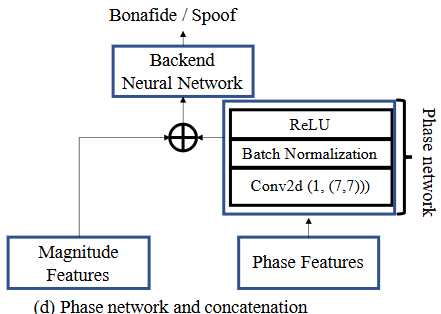
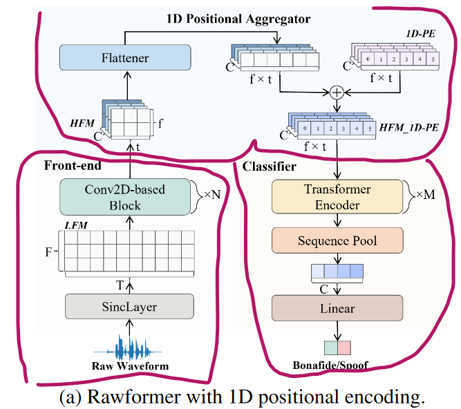
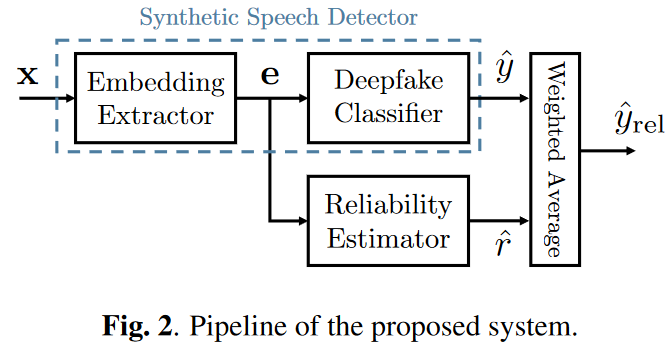
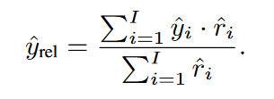
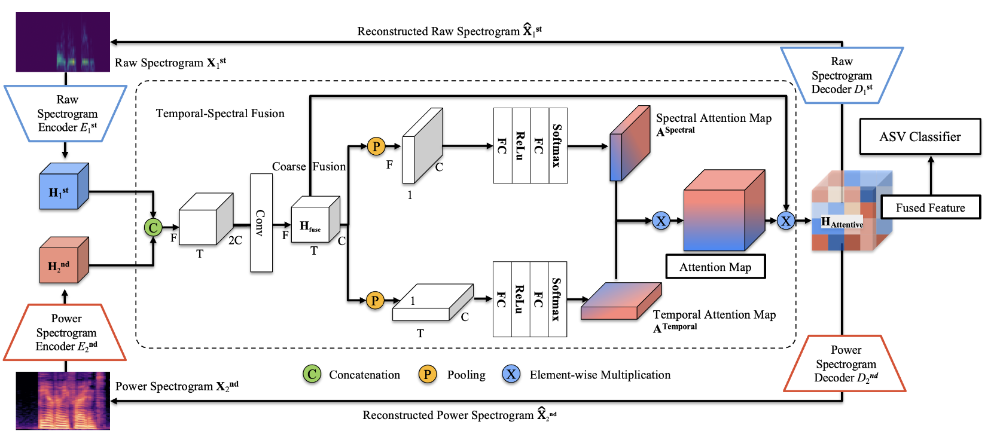
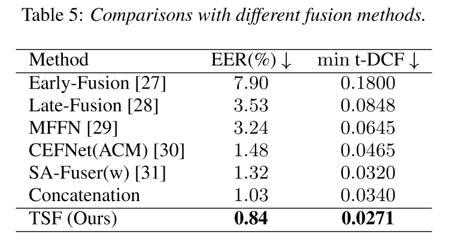

paper summarization

i only focus on the LA track of FAD（partial spoof is not my concern）

this document is to record my thoughts and paper summary after reading papers. 

in the **METHOD** section,i will briefly introduce what paper is about. 

in the **experiments** section, i will record some results i am interested. 

finally in the **COMMENTS** section, i will write down something might be offensive or pleasing depends on the quality of the paper and my mood

method

experiments

comments

# icassp

## 2023

### Learning From Yourself: A Self-Distillation Method for Fake Speech Detection

##### method

self-distillation, using deep layer to guide shallow layers feature and prediction result during training

[one final block guide the 3 former shallow blocks]

loss restriction including 

1. hard loss (using ground true label and final prediction), 
2. soft loss(using deep layer prediction and shallow layers prediction[adding additional classifiers]), 
3. feature loss (using L2 to compute final feature and the feature from the shallow layers)

##### experiments

proving points: this training methods can improve and gain competitive performance of base model (including ECANet9 ECANet18 ECANet34 ECANet50 SENet9 SENet18 SENet34 SENet50)

datasets: asvspoof19 LA+PA

not SOTA  but method is proved effective

##### comments

additional portable classifiers need to be trained additionally and distillation temperature can be very uncertain, it might be a good way to improve base model, but too uneasy

good idea anyway

### Graph-Based Spectro-Temporal Dependency Modeling for Anti-Spoofing

##### method

focusing specific frequency sub-bands or temporal segments???

this paper presents a new model architecture, using time-frequency representation (like linear filterbanks) as input

1.  coarse feature 

   divide linear filterbanks into overlapping patches, using CNN to map them into a C-dimensional embedding vector 

   num of vec = num of channel  C * num of temporal segments  T * num of sub-bands F

2. construct graph

   patch-to-node strategy

   edges only exist between nodes from the same sub-band or temporal segments

   using the similarity between connected nodes as edge weight

3. adding learn-able position embedding

    position embedding is a learnable vector C * T * F

4. multi-layer graph convolutional network

5. attentive graph pooling, finally done the average to gain the prediction


##### experiments

proving points: better performance

datasets: asvspoof19 LA

eer-0.71(0.58) , three runs averaged(best)

##### comments

well designed model, better performance than the aasist using raw wavform, using linear filterbanks as input and modeling it can make the FAD method more interpretable. it's a **pity** the model is not open source, otherwise the community could be using it to do more exploration about how and why this model architecture could work and what exactly this model based on to detect fake audio.

### Can Spoofing Countermeasure And Speaker Verification Systems Be Jointly Optimised?

##### method

like the title

##### experiments

not interested

##### comments

FAD is an un-well-solved problem, and so does low-resource-speaker-identification, i think it's too early to merge them together and expect this two tasks  will enhance each other. but idea is good and novel enough


### Spoofed Training Data for Speech Spoofing Countermeasure Can Be Efficiently Created Using Neural Vocoders

##### method

data driven method

using 4 non-AR vocoder to do the analysis-synthesis, producing so-called Vocoded Data

bona-fide audio is from the asvspoof19 train set

using Contrastive Feature Loss for Bona Fide and Vocoded Data, 

**Bona-spoof paired**: a mini batch contain 1 bonafide and k spoof (k is the num of vocoders)

##### experiments

using the Bona Fide and Vocoded Data as train set, dev set is ASVspoof 2019 dev

⭐ back bone using wav2vec2 pre-train model+GAP/3FC/LeakyReLU/FC

|          | CELoss+CFLoss+RawBoost+voc·v4 | no DA |
| -------- | ----------------------------- | ----- |
| LA21hid  | 14.57                         | 15.05 |
| DF21hid  | 7.78                          | 8.17  |
| WaveFake | 2.5                           | 4.03  |
| InWild   | 7.55                          | 9.37  |


##### comments

the reason why choosing the vocoder is convincing, data driven is quite violent but for DF scenario is effective 

the vocoded data can be quite useful to explore more training methods 


### SAMO: Speaker Attractor Multi-Center One-Class Learning For Voice Anti-Spoofing

##### method

work after OC-softmax, basic idea of OC-softmax is the bonafide speech feature should be more compact. 

this paper points out that the performance might be influenced by the diversity of speakers, so multi-center one-class learning is proposed

using aasist as backbone

```python
# code difference
# oc softmax with only one center
self.center = torch.eye(self.feat_dim)[:1]
# samo using centers
self.center = torch.eye(self.feat_dim)[:self.num_centers]
```

need to set interval to update the centers, and using cosine similarity to compute the loss between feature and centers

##### experiments

proving points: better than oc-softmax

datasets: asvspoof19 LA

|                     | eer[3 runs average(best)] |
| ------------------- | ------------------------- |
| softmax             | 1.74(1.25)                |
| oc-softmax          | 1.25(1.17)                |
| samo w enrollment   | 1.09(0.91)                |
| samo w/o enrollment | 1.08(0.88)                |


##### comments

good motivation, num_centers is a tricky thing, i think it should not be constrained by the number of speakers in train set (experiments to be done)

long live open source!!! may the authors who wrote this have good fortune in the future research to do

### Phase-Aware Spoof Speech Detection Based On Res2net with Phase Network

##### method

if we know the phase and magnitude info, we can reconstruct the audio and image.[ yes, the idea of this paper comes from the CV field ]

the combination of phase and magnitude info in previous studies might be defected by the randomness of the phase spectrum, so this paper proposes that using a network to first additionally process the phase, then conduct the combination.  



##### experiments

proving points: better performance compare to the previous methods using magnitude and phase info

datasets: asvspoof19 LA+PA

| using CQT+Phase                  | eer        |
| -------------------------------- | ---------- |
| res2net (base)                   | 1.7(1.31)  |
| feature fusion                   | 1.76(1.47) |
| score fusion                     | 1.63(1.29) |
| feature fusion and phase network | 1.07(0.94) |


##### comments

how randomness  of the phase spectrum influences the network prediction and feature? 

this question is quite hard to answer and prove

and this network (i think) might be quite sensitive to the channel encoding and noise 


### Leveraging Positional-Related Local-Global Dependency for Synthetic Speech Detection

##### method

this paper presents a new model architecture



three parts of this model is clear to understand

1. sinclayer is proved to be a good feature extractor, like rawnet2
2. positional aggregator is from a CV field paper
3. classifier is similar with a SPL paper[The Role of Long-Term Dependency in Synthetic Speech Detection]

##### experiments

datasets: asvspoof 19+21 LA

|      | fixed(64600) | var  |
| ---- | ------------ | ---- |
| 19   | 1.05         | 0.59 |
| 21   | 4.98         | 4.53 |


##### comments

this model is like a lego, the performance is so goooooood, but not open source, another pity, but there is an unofficial implementation (not having a try yet)


### Reliability Estimation for Synthetic Speech Detection

##### method

using another network to decide if the embedding is deserved to be detected as real or fake (output a score, network is a simple FC*3, more details in paper)






##### experiments

improve the accuracy as shown in the ROC curve

##### comments

the method is familiar with score fusion methods, but changes that to another saying

there will be an basic problem is that we should train another network, and i doubt its stability and generalization when the FAD network changed to another   

but this paper focus on the generalization capabilities of the proposed method on unseen datasets


# icme

### Mel-Spectrogram Image-Based End-to-End Audio Deepfake Detection Under Channel-Mismatched Conditions

##### method

##### experiments

##### comments


# interspeech

## 2023

### Robust Audio Anti-Spoofing with Fusion-Reconstruction Learning on Multi-Order Spectrograms

##### method

fuse multi-order spectrograms to gain fused feature for FAD

consider sincnet output as first order spectrogram, use  ResNet*6 as encoder

consider LFCC as second order spectrogram, use ResNet-18 as encoder




using the final fusion feature to respectively reconstruct the raw-wav and LFCC for minimizing the information loss, both reconstruction losses are mse Loss

the classifier is AASIST

##### experiments

ASVspoof19LA-EER ( 0.77 )


ablation study shows that the fusion is mostly better than only using one of them



concat seems the simplest and the secondly effective way :)

##### comments

the code is available, great!

shining point is the motivation of the reconstruction part

but i think maybe better using mutual information methods to further lower the influence that one spectrogram might cause to another one?  and then using concat :) 

