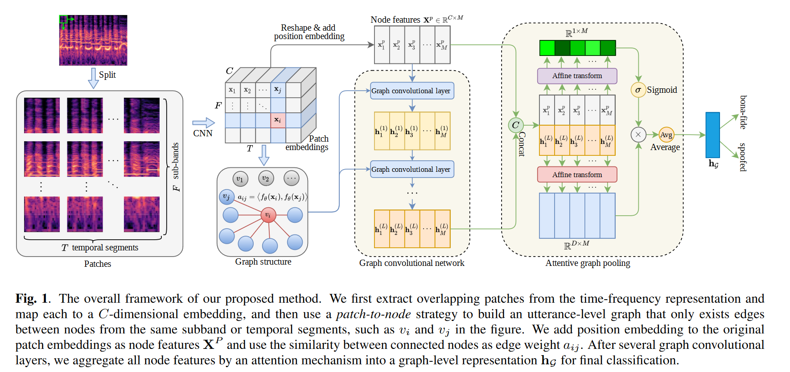

paper summarization

i only focus on the LA track of FAD

# icassp

## 2023

#### Learning From Yourself: A Self-Distillation Method for Fake Speech Detection

##### method

self-distillation, using deep layer to guide shallow layers feature and prediction result during training

[one final block guide the 3 former shallow blocks]

loss restriction including 

1. hard loss (using ground true label and final prediction), 
2. soft loss(using deep layer prediction and shallow layers prediction[adding additional classifiers]), 
3. feature loss (using L2 to compute final feature and the feature from the shallow layers)

##### experiments

proving points: this training methods can improve and gain competitive performance of base model (including ECANet9 ECANet18 ECANet34 ECANet50 SENet9 SENet18 SENet34 SENet50)

datasets: asvspoof19 LA+PA

not SOTA  but method is proved effective

##### comments

additional portable classifiers need to be train additionally and distillation temperature can be very uncertain, it might be a good way to improve base model, but too uneasy

good idea anyway

#### Graph-Based Spectro-Temporal Dependency Modeling for Anti-Spoofing

##### method

focusing specific frequency sub-bands or temporal segments???

this paper presents a new model architecture, using time-frequency representation (like linear filterbanks) as input

1.  coarse feature 

   divide linear filterbanks into overlapping patches, using CNN to map them into a C-dimensional embedding vector 

   num of vec = num of channel  C * num of temporal segments  T * num of sub-bands F

2. construct graph

   patch-to-node strategy

   edges only exist between nodes from the same sub-band or temporal segments

   using the similarity between connected nodes as edge weight

3. adding learn-able position embedding

    position embedding is a learnable vector C * T * F

4. multi-layer graph convolutional network

5. attentive graph pooling, finally done the average to gain the prediction

##### experiments

proving points: better performance

datasets: asvspoof19 LA

eer-0.71(0.58) , three runs averaged(best)

##### comments

well designed model, better performance than the aasist using raw wavform, using linear filterbanks as input and modeling it can make the FAD method more interpretable. it's a **pity** the model is not open source, otherwise the community could be using it to do more exploration about how and why this model architecture could work and what exactly this model based on to detect fake audio.

#### Can Spoofing Countermeasure And Speaker Verification Systems Be Jointly Optimised?

##### method

like the title

##### experiments

not interested

##### comments

FAD is an un-well-solved problem, and so does low-resource-speaker-identification, i think it's too early to merge them together and expect this two tasks  will enhance each other. but idea is good and novel enough

#### Waveform Boundary Detection for Partially Spoofed Audio

##### method

##### experiments

##### comments

#### Spoofed Training Data for Speech Spoofing Countermeasure Can Be Efficiently Created Using Neural Vocoders

##### method

data driven method

using 4 non-AR vocoder to do the analysis-synthesis, producing so-called Vocoded Data

bona-fide audio is from the asvspoof19 train set

using Contrastive Feature Loss for Bona Fide and Vocoded Data, 

**Bona-spoof paired**: a mini batch contain 1 bonafide and k spoof (k is the num of vocoders)

##### experiments

using the Bona Fide and Vocoded Data as train set, dev set is ASVspoof 2019 dev

⭐ back bone using wav2vec2 pre-train model+GAP/3FC/LeakyReLU/FC

|          | CELoss+CFLoss+RawBoost+voc·v4 | no DA |
| -------- | ----------------------------- | ----- |
| LA21hid  | 14.57                         | 15.05 |
| DF21hid  | 7.78                          | 8.17  |
| WaveFake | 2.5                           | 4.03  |
| InWild   | 7.55                          | 9.37  |

##### comments

the reason why choosing the vocoder is convincing, data driven is quite violent but for DF scenario is effective 

the vocoded data can be quite useful to explore more training methods 

#### Shift to Your Device: Data Augmentation for Device-Independent Speaker Verification Anti-Spoofing

##### method

##### experiments

##### comments

#### SAMO: Speaker Attractor Multi-Center One-Class Learning For Voice Anti-Spoofing

##### method

##### experiments

##### comments

#### Phase-Aware Spoof Speech Detection Based On Res2net with Phase Network

##### method

##### experiments

##### comments

#### Leveraging Positional-Related Local-Global Dependency for Synthetic Speech Detection

##### method

this paper presents a new model architecture

##### experiments

##### comments

#### Identifying Source Speakers for Voice Conversion Based Spoofing Attacks on Speaker Verification Systems

##### method

##### experiments

##### comments

